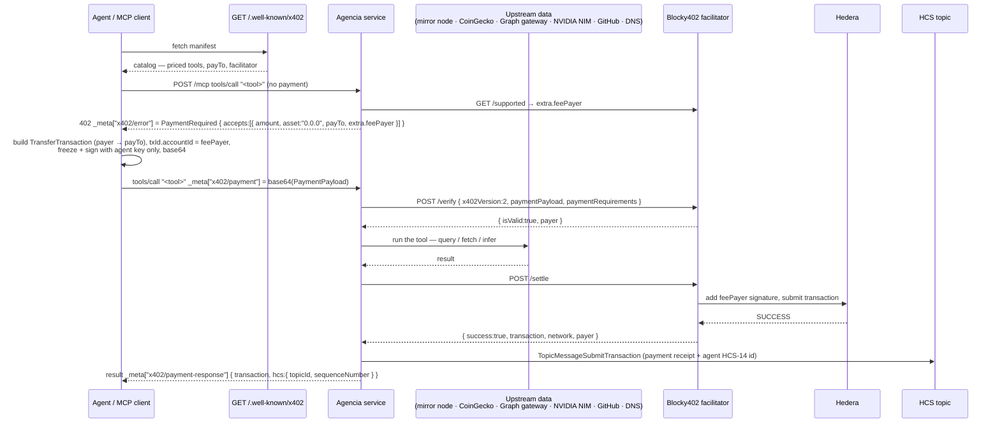

<div align="center">

# Agencia

### Connect your agent to every service it needs.

*Pay-per-call inference, on-chain data, and price feeds on **Hedera** — gated by [x402](https://x402.org) (v2, `exact` scheme) and settled through the **[Blocky402](https://blocky402.com)** facilitator. No API key, no subscription, no invoice.*

[](https://hedera.com)
[](https://x402.org)
[](https://blocky402.com)
[](https://thegraph.com)
[](https://www.typescriptlang.org/)
[](https://astro.build)
[](https://modelcontextprotocol.io)

</div>

---

## What is Agencia?

Buying API access today means an account, a card, a subscription, a human in the loop. None of that works for an autonomous agent calling dozens of services on its own. Agencia replaces the billing relationship with the request itself: an agent discovers a service from a public manifest, pays the exact price for **one call** in HBAR, and gets its answer — settled on Hedera in under a second, for a fraction of a cent.

One service, three ways in:

- **Dashboard** — a live console: browse the catalog, call any service, watch the 402 → pay → settle flow happen, track spend and revenue.
- **CLI agent** — `npm run agent "<prompt>"` runs the whole discover → pay → call loop from a terminal, no browser.
- **MCP endpoint** — point any MCP client (Claude, Cursor, your own agent) at `/mcp`; every tool below is callable directly, payment included.

> **Why it matters:** sub-cent fixed cost makes per-call pricing viable where card-network fees don't; sub-second finality means the agent doesn't wait; a public HCS audit trail means the payment is verifiable by anyone, not just trusted on Agencia's word.

---

## Features

### The catalog — 14 services, 7 categories

Every row is a real paid MCP tool, wired through the same `registerPaidTool` wrapper — 402 → verify → run → settle → HCS receipt.

| Tool | Category | What it does | Price |
|---|---|---|---|
| `infer` | Inference | Chat completion on the hosted model (NVIDIA NIM) | perCall + per-1k-token |
| `infer_openai` | Inference | Chat completion on OpenAI (`gpt-4o-mini` by default) | perCall + per-1k-token |
| `hedera_account` | Hedera Data | Balance, HTS token balances, recent transfers | 0.01 ℏ / query |
| `hedera_token` | Hedera Data | HTS supply, treasury, type, top holders | 0.01 ℏ / query |
| `hedera_topic` | Hedera Data | Recent HCS consensus messages | 0.005 ℏ + 0.0005 ℏ / message |
| `hedera_transaction` | Hedera Data | Result, fee, transfers for a transaction id | 0.01 ℏ / query |
| `hedera_nft` | NFTs | Owner, metadata, mint time for an NFT serial | 0.01 ℏ / query |
| `hedera_network` | Hedera Data | Released/total HBAR supply, live USD exchange rate | 0.003 ℏ flat |
| `hbar_price` | Finance | HBAR spot price, 24h change, market cap | 0.002 ℏ flat |
| `crypto_price` | Finance | Spot price + 24h change for up to 25 coins | 0.003 ℏ flat |
| `web_read` | Web | Fetch a URL, return its title + readable text | 0.01 ℏ flat |
| `dns_lookup` | Web | Resolve DNS records over Cloudflare DoH | 0.004 ℏ flat |
| `graph_query` | The Graph | Run a GraphQL query against any subgraph | 0.01 ℏ / query |
| `github_repo` | Dev | Stars, forks, issues, license for a public repo | 0.005 ℏ flat |

All prices are live-computed per call — `infer`'s scales with `max_tokens`, `hedera_topic`'s scales with the number of messages returned. Nothing is a flat per-request tax.

### The payment flow

- x402 **v2**, `exact` scheme, official **`@x402/core`** + **`@x402/hedera`** SDK — the wire format is exactly what Blocky402 expects.
- The agent builds a `TransferTransaction`, sets `transactionId.accountId` to the facilitator's fee payer, and **partially signs** with only its own key — Blocky402 co-signs and submits.
- Every settlement is written to an **HCS topic** as an immutable receipt, including the caller's HCS-14 agent id.

### The dashboard

Seven routes, one persistent client-side store (`sessionStorage`-backed, revalidates in the background, survives navigation):

- **Catalog** — search + category filter over the whole manifest; every card expands into a try-it form.
- **Playground** — pick any tool, watch the exact request JSON build as you type, run it, inspect the raw response.
- **The Graph** — a dedicated subgraph query console.
- **Wallet** — live agent balance (mirror node), HTS holdings, session spend.
- **Budgets** — session and per-call HBAR caps, enforced **server-side before payment is built**.
- **Usage** — revenue over time, by category, by tool, top payers — all derived from the on-chain HCS audit trail.
- **HCS audit trail** — the raw settlement receipts, straight off the topic.

### The agent

- **HCS-14-flavored identity** — a deterministic `hcs-14:<hash>` id, optionally published to its own HCS topic.
- **Budget cap** — refuses to pay past `AGENT_BUDGET_HBAR` before a transaction is ever built.
- **Metered streaming** — `npm run stream` pays every few seconds via Scheduled Transactions, for compute or bandwidth billed by time.

---

## 🏛️ Architecture



| Layer | Role | Backed by |
|---|---|---|
| Discovery | Priced-tool catalog, pricing, payTo | `GET /.well-known/x402` |
| Payment | Build, verify, settle the x402 transfer | `@x402/core` + `@x402/hedera`, Blocky402 |
| Settlement | Final transaction submission | Hedera (testnet / mainnet) |
| Audit | Immutable receipt trail | an HCS topic |
| Data | The actual work behind each tool | mirror node, CoinGecko, Graph gateway, NVIDIA NIM, GitHub, Cloudflare DoH |

### Pricing — metered, not flat

```
price(args) = perCallHbar + per1kTokenHbar * (max_tokens / 1000)   // infer
price(args) = perCallHbar + perResultHbar * limit                  // hedera_topic
price(args) = perCallHbar                                          // everything else
```

Defined once per tool in `src/service/catalog.ts` and read by both the manifest and the MCP tool that charges it — the price shown to a caller and the price it's actually charged can't drift apart.

---

## Project structure

```
src/
  config.ts                    env, HBAR/tinybar helpers, CAIP-2 network
  x402.ts                      v2 type re-exports, X-PAYMENT codec, _meta keys
  facilitator.ts               HTTPFacilitatorClient → Blocky402 (verify/settle/supported)
  hedera.ts                    HCS client, topic create + message (@hashgraph/sdk)
  index.ts                     service entrypoint

  service/
    catalog.ts                 every tool: title, category, params, pricing — single source of truth
    manifest.ts                /.well-known/x402 document, built from the catalog
    http/{server,origin}.ts, http/routes/{health,manifest,mcp}.ts
    mcp/server.ts               registers every tool group
    mcp/tools/{discover,infer,hedera,price,external,graph}.ts
    payments/paid-tool.ts       registerPaidTool: 402 → verify → run → settle → HCS audit
    capabilities/{inference,hedera-data,price,external,graph}.ts   the paid work itself
    audit/hcs.ts                writes settlement receipts to HCS

  agent/
    discover.ts                 fetch + parse the manifest
    wallet.ts                   x402Client + ExactHederaScheme + budget cap
    identity.ts                 HCS-14 agent identifier + optional topic profile
    stream.ts                   metered streaming payments via Scheduled Transactions
    run.ts                      end-to-end: identity → discover → 402 → pay → retry → receipt

scripts/
  create-topic.ts               HCS topic creation (audit | identity)
  stream.ts                     run a metered payment stream

web/                             Astro dashboard — see web/README.md
  src/pages/dashboard/[tab].astro
  src/components/dashboard/{Shell,store,types}.tsx
  src/components/dashboard/panels/{Catalog,Playground,Graph,Wallet,Budgets,Usage,Audit}.tsx
  src/server/pay-flow.ts        runs the full pay flow server-side; the agent key never reaches the browser
```

### HTTP routes

| Method | Path | Purpose |
|---|---|---|
| `GET` | `/health` | status, network, x402 version, facilitator, payTo, topic |
| `GET` | `/.well-known/x402` | discovery manifest — the whole catalog |
| `ALL` | `/mcp` | MCP streamable-http — every tool in the catalog |

---

## Setup

### 1. Accounts

Create two Hedera **testnet** accounts at [portal.hedera.com](https://portal.hedera.com): one for the Agencia service, one for the agent. Fund both with test HBAR. **ECDSA keys** are recommended (the x402 Hedera live path assumes ECDSA).

> **If you funded an account by sending HBAR to a raw EVM address** (rather than creating it through the portal), it comes back as a *hollow account* — the mirror node shows `"key": null` until that account pays for one transaction of its own. The x402 flow never makes the agent the fee payer (the facilitator always is), so a hollow agent account will fail settlement with `INVALID_SIGNATURE` until you send it through one self-paid bootstrap transaction first (any `TransferTransaction` where the account itself is both payer and signer — e.g. a tiny transfer to the service account).

### 2. Install

```bash
cd hedera/agencia
npm install
cp .env.example .env
```

Fill in `.env`:

- `AGENCIA_OPERATOR_ID` / `AGENCIA_OPERATOR_KEY` — service account (also the HCS audit signer)
- `AGENCIA_PAY_TO` — where payments land (defaults to the operator)
- `AGENT_ACCOUNT_ID` / `AGENT_PRIVATE_KEY` — agent account
- `NVIDIA_API_KEY` — key for `integrate.api.nvidia.com`, powers `infer` (model `openai/gpt-oss-20b`)
- `OPENAI_API_KEY` — optional; powers `infer_openai` (model `gpt-4o-mini` by default)
- `BLOCKY402_URL` — defaults to `https://api.testnet.blocky402.com` (testnet is open, no key)
- `GRAPH_API_KEY` — optional; only needed to query a bare subgraph id instead of a full endpoint URL

### 3. Create the HCS topics

```bash
npm run create-topic           # -> AGENCIA_HCS_TOPIC_ID   (audit trail)
npm run create-topic identity  # -> AGENT_IDENTITY_TOPIC_ID (optional HCS-14 profile)
```

### 4. Run

```bash
# terminal 1 — the service
npm run server

# terminal 2 — the agent makes one real paid request
npm run agent "Summarize the Hedera consensus service in 3 bullets"

# optional — a metered payment stream (Scheduled Transactions)
AGENCIA_PAY_TO=0.0.xxxx npm run stream 20 5 0.001   # 20s, tick every 5s, 0.001 HBAR/s

# optional — the dashboard (separate install, see web/README.md)
cd web && npm install && npm run dev
```

Verify the HCS audit entry:

```bash
curl "https://testnet.mirrornode.hedera.com/api/v1/topics/<AGENCIA_HCS_TOPIC_ID>/messages"
```

---

## 🔒 Security & trust

The agent's private key never reaches a browser — the dashboard proxies the entire pay flow through its own backend (`web/src/server/pay-flow.ts`); the client only ever sees the result and a HashScan link. Budget caps are checked **before** a payment transaction is built, not after. Every settled call lands on an HCS topic — an append-only, publicly verifiable record that can't be edited after the fact. No caller needs an account or API key with Agencia itself; the only credential in the whole flow is the payment.

---

## Status

| Area | Status |
|---|---|
| Service compiles, typechecks | ✅ `tsc --noEmit` clean |
| Web dashboard compiles, typechecks | ✅ `astro check` clean |
| Data tools (`hedera_*`, `*_price`, `web_read`, `dns_lookup`, `github_repo`) | ✅ tested against their live upstreams (mirror node, CoinGecko, Cloudflare DoH, GitHub) |
| `graph_query` | ✅ plumbing verified against the live Graph gateway (real auth-error response); a real query needs a subgraph URL or `GRAPH_API_KEY` |
| **Full x402 paid round trip** (`/verify` + `/settle` + on-chain submit) | ✅ **live on testnet** — [`0.0.7162784-1789213920-680935670`](https://hashscan.io/testnet/transaction/0.0.7162784-1789213920-680935670): agent `0.0.10500131` paid `0.002 HBAR` to `0.0.10500124` via Blocky402, HCS receipt `0.0.10500159#1` |
| `infer` | ✅ live — real paid completion settled, e.g. HCS receipt `0.0.10500159#2` |
| `infer_openai` | ✅ live — real paid completion settled, e.g. HCS receipt `0.0.10500159#3` |
| Multi-agent negotiation (A2A / ACP) | ⬜ not started — the buyer agent is single-step, price is fixed by the seller |
| HTS tokens / custom fee schedules | 🟡 `asset` flows through the v2 requirements; only the HBAR (`0.0.0`) path is wired |

---

## 📄 License

No license file is committed yet — treat this repo as **all rights reserved** until one is added.

<div align="center">
<sub>Built on <a href="https://hedera.com">Hedera</a> · <a href="https://x402.org">x402</a> · <a href="https://blocky402.com">Blocky402</a> · <a href="https://thegraph.com">The Graph</a></sub>
</div>
