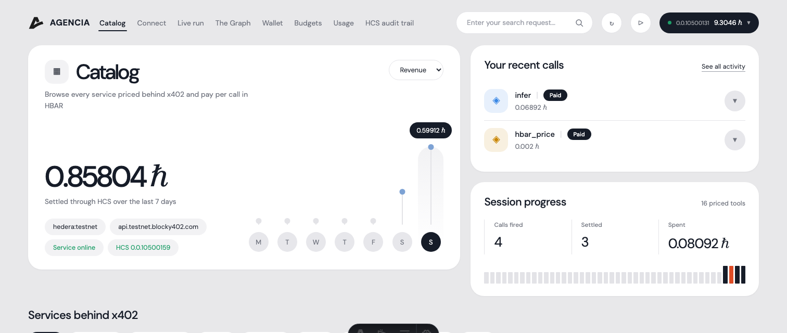
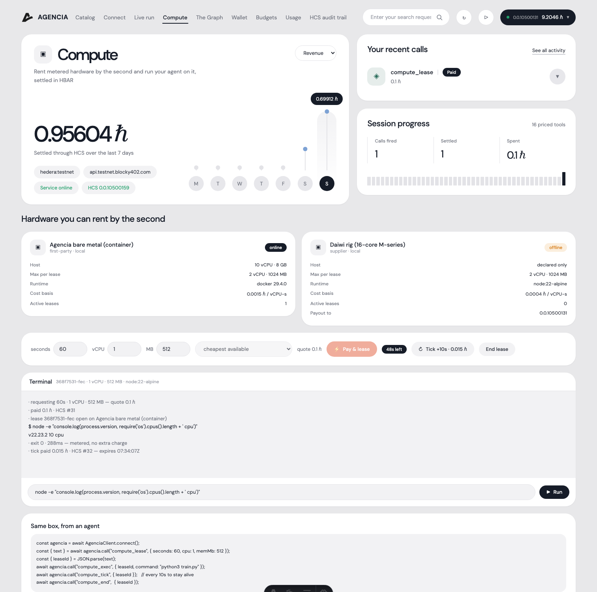
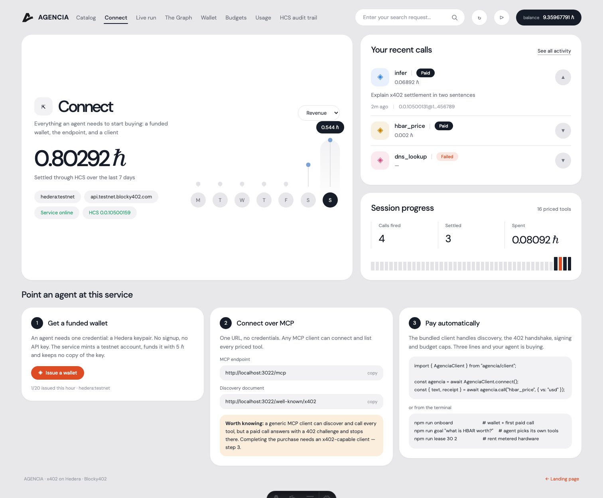
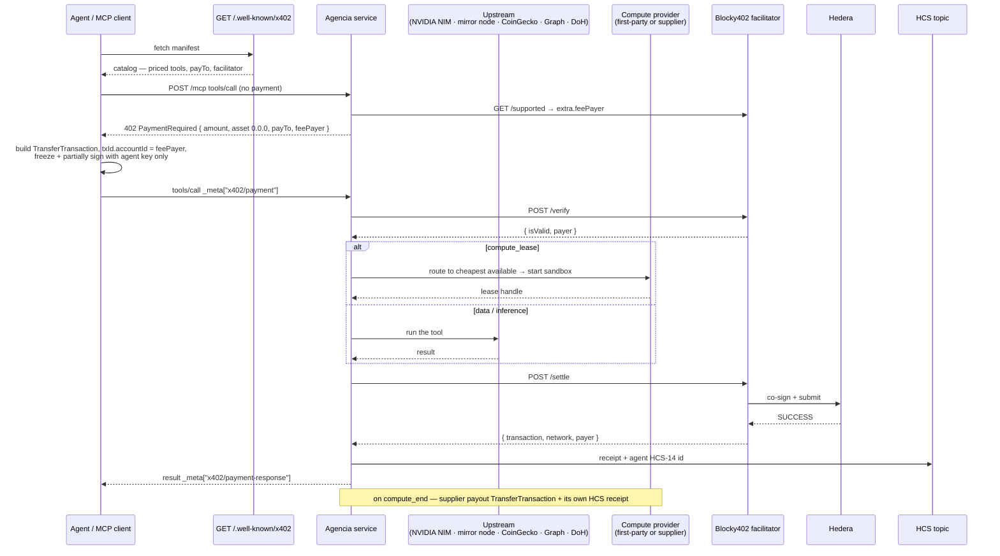

<div align="center">


# Agencia

### Connect your agent to every service it needs.

*Pay-per-call inference, on-chain data, price feeds and **metered hardware** on **Hedera** — gated by [x402](https://x402.org) (v2, `exact` scheme) and settled through the **[Blocky402](https://blocky402.com)** facilitator. No API key, no subscription, no invoice.*

[](https://hedera.com)
[](https://x402.org)
[](https://blocky402.com)
[](https://build.nvidia.com)
[](#-compute--rent-hardware-by-the-second)
[](https://docs.hedera.com/hedera/core-concepts/consensus-service)
[](https://thegraph.com)
[](https://modelcontextprotocol.io)
[](https://agencia.reroute-stellarbackend.workers.dev/health)
[](https://0xagencia.vercel.app)
[](https://www.typescriptlang.org/)
[](https://astro.build)

**Dashboard —** [`0xagencia.vercel.app`](https://0xagencia.vercel.app)  ·  **Service —** [`agencia.reroute-stellarbackend.workers.dev`](https://agencia.reroute-stellarbackend.workers.dev/health) · [manifest](https://agencia.reroute-stellarbackend.workers.dev/.well-known/x402) · MCP at `/mcp`

</div>

---

## What is Agencia?

Buying API access today means an account, a card, a subscription, a human in the loop. None of that works for an autonomous agent calling dozens of services on its own. Agencia replaces the billing relationship with the request itself: an agent discovers a service from a public manifest, pays the exact price for **one call** in HBAR, and gets its answer — settled on Hedera in under a second, for a fraction of a cent.

It runs in both directions. **Consumers** buy inference, on-chain data and sandboxed hardware per unit. **Suppliers** register their own machines against a five-endpoint contract and get paid in HBAR for every second they sell.

**Five ways in:**

- **Dashboard** — a live console: browse the catalog, watch an agent discover and pay step by step, rent hardware and drive it from a browser terminal.
- **Autonomous agent** — `npm run goal "<goal>"`: it reads the catalog at runtime, **buys its own reasoning**, picks its own tools, and answers.
- **Drop-in client** — `AgenciaClient.connect()` handles discovery, the 402 handshake, signing and budget caps in three lines.
- **MCP endpoint** — point any MCP client at `/mcp`; every tool is listed with no credentials at all.
- **One-command onboarding** — `npm run onboard` issues a funded testnet wallet and makes a real paid call, start to finish.

> **The only credential anywhere in this project is a Hedera keypair.** Not for the catalog, not for the hardware, not even for the agent's own reasoning — it pays for that through the same rail.

---

## Features

### The catalog — 19 priced tools, 8 categories

Every row is a real paid MCP tool through the same `registerPaidTool` wrapper: **402 → verify → run → settle → HCS receipt**.

| Tool | Category | What it does | Price (ℏ) |
|---|---|---|---|
| `infer` | Inference | Chat completion on **NVIDIA NIM** (`openai/gpt-oss-20b`) | `0.05` + `0.02`/1k tok |
| `infer_openai` | Inference | Chat completion on OpenAI (`gpt-4o-mini`) | `0.03` + `0.015`/1k tok |
| `compute_lease` | Compute | Rent a sandboxed container by the second | `0.01` + `0.0015`/vCPU-s |
| `compute_tick` | Compute | Extend a live lease by one metering interval | `0.0015`/vCPU-s |
| `hedera_account` | Hedera Data | Balance, HTS holdings, recent transfers | `0.01` |
| `hedera_token` | Hedera Data | HTS supply, treasury, type, top holders | `0.01` |
| `hedera_topic` | Hedera Data | Recent HCS consensus messages | `0.005` + `0.0005`/msg |
| `hedera_transaction` | Hedera Data | Result, fee, transfers for a transaction id | `0.01` |
| `hedera_network` | Hedera Data | HBAR supply + live USD exchange rate | `0.003` |
| `hedera_nft` | NFTs | Owner, metadata, mint time for an NFT serial | `0.01` |
| `hbar_price` | Finance | HBAR spot price, 24h change, market cap | `0.002` |
| `crypto_price` | Finance | Spot price for up to 25 coins | `0.003` |
| `web_read` | Web | Fetch a URL, return title + readable text | `0.01` |
| `dns_lookup` | Web | Resolve DNS over Cloudflare DoH | `0.004` |
| `graph_query` | The Graph | GraphQL against any subgraph | `0.01` |
| `graph_schema` | The Graph | Introspect a subgraph's entities and fields | `0.005` |
| `graph_ask` | The Graph | **Plain-English question → GraphQL → live data → answer** | `0.04` |
| `graph_analyze` | The Graph | **Live subgraph rows, computed on hardware you rent by the second** | `0.06` + `0.0015`/s |
| `github_repo` | Dev | Stars, forks, issues, license for a repo | `0.005` |

Plus four **free** tools that need no payment: `discover`, `compute_exec`, `compute_end`, `compute_providers`.

Prices are computed per call — `infer` scales with `max_tokens`, `hedera_topic` with messages returned, `compute_lease` with seconds × vCPU. Nothing is a flat per-request tax.

<div align="center"></div>

### The Graph × compute — analysis, not lookups

A GraphQL response tells you *what is*. `graph_analyze` works out *what it means*, and it needs both halves of the stack:

1. **introspect** the subgraph schema
2. a model **writes the GraphQL** for your analytical goal
3. run it against **live Graph data** through the gateway
4. **rent a sandbox by the second** and push the rows into it
5. a model **writes a program for that question**; it runs *on the rented box*
6. a model **explains what the computation found**, citing the numbers

One call, priced `0.06 ℏ + 0.0015 ℏ/compute-second`, settled once on Hedera. Verified against the live Uniswap V3 subgraph — 10 pools pulled, analysed on a container, closed, HCS receipt `#58`:

```
=== TVL Concentration Report ===
Top 3 pools hold 99.82% of total TVL
Top 10 pools hold 100.00% of total TVL
```

The script is written per question and never leaves the box; if it crashes, the error goes back to the model once. **If the analysis fails, you are not charged** — the tool errors before settlement.

> **Read the output critically:** ordering Uniswap pools by `totalValueLockedUSD` surfaces spam pools with absurd valuations, so the figures above are arithmetically correct on garbage input. Production analysis should filter by `volumeUSD` or a token whitelist. The pipeline is sound; the default query is naive.

### On-chain discovery — no URL required

A service announces itself to a **Hedera consensus topic**. An agent that knows only the topic id reads the registry off the mirror node, picks a service, fetches its catalog and pays it — nobody hands it an endpoint:

```
$ npm run find
[agent] reading the x402 service registry on HCS topic 0.0.10521746

  Agencia — hedera:testnet
    origin    http://localhost:3022
    payTo     0.0.10500124 (HBAR, api.testnet.blocky402.com)
    tools     16 priced · from 0.002 ℏ · Inference, Hedera Data, NFTs, Finance, Web, The Graph, Compute, Dev
    audit     0.0.10500159

[agent] nobody gave me a URL — fetching Agencia's catalog from its announcement
[agent] 4 tools need no arguments — cheapest is hbar_price at 0.002 ℏ
  402 hbar_price — paying 0.002 HBAR
  settled — HCS receipt #56
```

The announcement is a compact pointer (627 bytes, one HCS message) — identity, endpoint, payTo, tool count and price floor — with the full catalog left at `/.well-known/x402`. Any service can publish to the same topic; the registry is a public consensus log, not our database.

### The autonomous agent — discovery you can watch

`npm run goal "what is HBAR worth, and how much does 0.0.10500124 hold?"`

The agent holds **one credential: a Hedera keypair.** It fetches `/.well-known/x402`, builds its tool list at runtime, then **buys its own reasoning** through the same x402 rail before every decision:

| Turn | What it did | Cost |
|---|---|---|
| 1 | bought reasoning → *"Get the spot price of HBAR in USD"* → chose `hbar_price` | `0.058` + `0.002` ℏ |
| 2 | bought reasoning → *"Need account balance"* → chose `hedera_account` | `0.058` + `0.01` ℏ |
| 3 | bought reasoning → *"We already have both"* → answered | `0.058` ℏ |

Nobody told it `hbar_price` existed. Every step is receipted on HCS. The **Live run** tab streams this over SSE, one card per phase — identity → discovery → 402 → signature → settlement → HCS receipt.

### Compute — rent hardware by the second

A lease is a session, not a one-shot call: **open → exec → tick → end.**

- **Metered per CPU-second**, not per request. Execution is *free* — you pay for seconds, and command time is metered onto the receipt.
- **Streaming settlement** — each `compute_tick` is its own x402 settlement with its own HCS receipt. Stop paying and the reaper kills the box.
- **Routed across providers** — the cheapest available provider wins; the price the buyer sees is the list rate, so routing widens margin instead of moving the quote.
- **Owned by the wallet that paid.** The payer's account id is bound to the lease at settlement, and a one-time **lease token** is issued with it. Terminal access, ticks and teardown all require that token — another wallet cannot touch your box.
- **Survives restarts.** Leases persist to disk with their container handles. Restart the service and live leases resume, their containers untouched; only genuinely expired ones are reaped.
- **Installs what you're missing, after you agree.** `compute_install` never downloads anything on the first call — it replies with the exact command it *would* run and waits for `confirm: true`.
- **Sandbox hardening** — non-root, `cap-drop ALL`, no-new-privileges, read-only rootfs with exec tmpfs, pids/CPU/memory caps, hard lease ceiling, orphan sweep on boot. Opt into `writable: true` at lease time if you need a package manager; the box is then root-writable and labelled as such.

| Surface | What you get |
|---|---|
| Dashboard **Compute** tab | Live hardware inventory, a lease control, and a browser terminal |
| `compute_exec` over MCP | Run commands from an agent — covered by the lease |
| `AgenciaClient` | `await agencia.call("compute_exec", { leaseId, command })` |
| `npm run lease 30 2` | Full lifecycle from a terminal |
| `compute_install` | Ask-then-install packages into your box |

**Choose your hardware:** runtime image (Node / Python / Alpine / Debian), vCPU, memory, `writable` mode, and either a named provider or `auto` for the cheapest one online. The provider list shows each machine's live rate, GPU flag and availability.

Hardware inventory is read live from the runtime (`docker info`), not declared in config — the card shows real vCPU, memory, daemon version and active lease count, and offline suppliers are shown as offline.

<div align="center"></div>

### The supplier side — an allowlist marketplace

Agencia doesn't integrate vendor SDKs; **suppliers integrate Agencia.** Anyone with a machine runs one script:

```bash
SUPPLIER_LABEL="my rig" SUPPLIER_RATE_PER_SECOND_HBAR=0.0004 npm run supplier
```

It serves five endpoints (`/health`, `POST /sandboxes`, `/exec`, `/extend`, `DELETE`), self-registers with its asking rate and **Hedera payout account**, and waits to be allowlisted. When a lease closes, the supplier is paid on-chain automatically:

| Leg | Rail | Receipt |
|---|---|---|
| Consumer → Agencia | x402 / Blocky402 | HCS receipt per call and per tick |
| Agencia → Supplier | direct `TransferTransaction` (70% default) | HCS receipt per payout |

The same contract is how third-party clouds plug in. `src/service/compute/directory.ts` lists researched providers with their real cost basis, converted live to HBAR — marked `not-configured` until someone actually onboards them:

| Provider | Kind | Cost basis | Adapter |
|---|---|---|---|
| E2B · Daytona | sandbox | ~`0.000217` ℏ/vCPU-s | shim |
| Cloudflare Containers | container | ~`0.000284` ℏ/vCPU-s | Worker shim |
| Modal | sandbox + **GPU** | ~`0.000528` ℏ/vCPU-s | shim |
| Fly.io Machines | VM | per-second | REST — least shim code |
| Shadeform · Prime Intellect | aggregator | 20–30+ clouds | shim |
| Vast.ai · Akash · Nosana · io.net | GPU marketplace | spot / on-chain lease | shim |

### Two payment rails

| Rail | Shape | Use it for |
|---|---|---|
| **x402** (`exact`, v2) | settle per call, or per tick on a lease | inference, data, compute |
| **Scheduled Transactions** | one `ScheduleCreateTransaction` per interval | bandwidth, subscriptions, anything billed by time |

The dashboard drives both: a **stream payments** toggle auto-pays lease ticks as expiry approaches, and the **Streamed payments** card fires scheduled transfers with live HashScan links.

### Onboarding — zero to paying

`POST /onboard` mints a real ECDSA testnet account, funds it, returns the key **once**, and keeps no copy (testnet-only, rate-limited, disableable).

```
no wallet configured — requesting one from the service…
✓ issued 0.0.10519636 on hedera:testnet, funded with 5 HBAR
✓ private key written to .env (never printed, never kept by the service)
  402 hbar_price — paying 0.002 HBAR
  settled — HCS receipt #29
```

<div align="center"></div>

### It introduces itself

`curl` the service, or connect any MCP client, and the first thing you get is how the money works — the protocol's `instructions` field carries it, so clients show it on connect:

```
╔════════════════════════════════════════════════════╗
║     ▄▀█ █▀▀ █▀▀ █▄░█ █▀▀ █ ▄▀█                     ║
║     █▀█ █▄█ ██▄ █░▀█ █▄▄ █ █▀█                     ║
║     pay-per-call services on Hedera, gated by      ║
║     x402. no API key. no subscription. no seat.    ║
╚════════════════════════════════════════════════════╝
```

…followed by the 402 handshake in three steps, the free tools to call first, the
lease lifecycle, and a plain warning that most MCP clients can quote but not pay.

### Connecting a client

The **Connect** tab carries copy-paste config for every client, and is honest about the ceiling — a normal MCP client can discover and call, but only an x402-capable one completes a purchase.

```bash
# Claude Code
claude mcp add --transport http agencia https://your-endpoint/mcp
```

```jsonc
{ "mcpServers": { "agencia": {                     { "mcpServers": { "agencia": {
    "type": "http",                                    "type": "streamable-http",
    "url": "https://your-endpoint/mcp" } } }           "url": "https://your-endpoint/mcp" } } }
```

### The bridge — make any MCP client able to pay

Claude and Cursor speak MCP but not x402, so pointed at the service directly they can
quote and never buy. `npm run bridge` is a **local stdio MCP server that holds the
wallet**: it mirrors every priced tool, answers the 402 itself, and hands the result
back with the receipt attached. The client never sees a payment.

```bash
npm run onboard                 # funded wallet, once
claude mcp add agencia -- npx tsx /ABS/PATH/agencia/src/client/bridge.ts
```

```jsonc
// Claude Desktop / Cursor — stdio entry
{ "mcpServers": { "agencia": {
    "command": "npx",
    "args": ["tsx", "/ABS/PATH/agencia/src/client/bridge.ts"] } } }
```

Every answer ends with what it cost:

```
… — paid 0.003 HBAR · HCS receipt #60 · tx 0.0.7162784@1789301469 · 4.997 HBAR left
```

Ask it `wallet_status` to see which account is paying and what budget remains.

### The dashboard — 9 tabs

**Catalog** · **Connect** · **Live run** · **Compute** · **Playground** · **The Graph** · **Budgets** · **Usage** · **HCS audit trail**

The wallet lives in the corner menu rather than a tab — balance, HTS token count, session spend, caps, copy-id, HashScan and wallet issuance, one click from any page. Budgets are enforced **server-side before a payment is built**. Usage charts are derived from the on-chain HCS trail, not from local state.

---

## Architecture



| Layer | Role | Backed by |
|---|---|---|
| Discovery | Priced catalog, pricing, payTo | `GET /.well-known/x402` |
| Payment | Build, verify, settle | `@x402/core` + `@x402/hedera`, Blocky402 |
| Settlement | Final submission | Hedera testnet / mainnet |
| Audit | Immutable receipts — both legs | one HCS topic |
| Inference | The model behind `infer` | **NVIDIA NIM** (`integrate.api.nvidia.com`) |
| Compute | Sandboxed hardware | local container runtime + allowlisted suppliers |
| Marketplace | Routing, allowlist, payouts | `src/service/compute/` |

### Pricing — metered, not flat

```
price(args) = perCallHbar + per1kTokenHbar * (max_tokens / 1000)     // infer
price(args) = perCallHbar + perResultHbar * limit                    // hedera_topic
price(args) = perCallHbar + perSecondHbar * seconds * cpu            // compute_lease
price(args) = perCallHbar                                            // everything else
```

Defined once per tool in `src/service/catalog.ts`, read by both the manifest and the tool that charges — quoted price and charged price can't drift.

---

## Endpoints

| Method | Path | Purpose |
|---|---|---|
| `GET` | `/health` | status, network, x402 version, facilitator, payTo, topic |
| `GET` | `/.well-known/x402` | discovery manifest — the whole catalog |
| `ALL` | `/mcp` | MCP streamable-http — every tool |
| `GET` | `/providers` | marketplace: suppliers + provider directory, USD→HBAR live |
| `POST` | `/providers/register` | a supplier self-registers (endpoint, rate, payout account) |
| `POST` | `/providers/:id/status` | allowlist / suspend a supplier (admin token) |
| `GET` | `/providers/suppliers` | registered suppliers and their earnings |
| `GET` | `/compute/inventory` | live hardware capacity, rates, active leases |
| `GET`·`POST` | `/onboard` | issue a funded testnet wallet |

**Dashboard APIs:** `/api/{call, compute, live, stream, onboard, wallet, audit, manifest, health}`

---

## Deploy — the service runs on Cloudflare Workers

The x402 service is deployed at the **edge**, with no Node runtime anywhere in the request path:

```bash
npx wrangler secret bulk secrets.json   # operator key, topic id, NVIDIA key
npx wrangler deploy                     # → agencia.<subdomain>.workers.dev
```

The dashboard deploys to **Vercel** from the `web/` directory (`@astrojs/vercel` adapter — pin `^9` for Astro 5; v11 requires Astro 7). Vercel's **Root Directory must be set to `web`**, and `AGENCIA_SERVICE_URL` is **required**, not optional: the server-side API routes default to `http://localhost:3022` and every panel fails without it. `AGENT_PRIVATE_KEY` goes in as an encrypted env var — the dashboard signs x402 payments server-side.

Three things had to be true to make this work, and all three are verified live:

| Concern | Resolution |
|---|---|
| **Hedera SDK on Workers** | The SDK's browser build talks **gRPC-web over plain `fetch`** to `testnet-nodeXX-00-grpc.hedera.com:443`. Aliased in `wrangler.jsonc`; HCS receipts are written from the edge. |
| **`window is not defined`** | The browser build touches `window` while mapping responses — shimmed to `globalThis` in the Worker entry. |
| **MCP transport** | The Node `StreamableHTTPServerTransport` needs `req`/`res` objects that don't exist on Workers, so `worker/mcp.ts` implements the JSON-RPC surface (`initialize`, `tools/list`, `tools/call`) directly. Catalog, pricing, capabilities and the x402 logic stay shared with the Node build. |

**Compute is served by supplier nodes, including through the edge.** Any machine that runs `npm run supplier` becomes rentable hardware. Point the Worker at a compute-capable origin and the edge serves leases for real:

```bash
cloudflared tunnel --url http://localhost:3022     # expose the supplier-backed service
# set COMPUTE_ORIGIN_URL on the Worker to that URL, then redeploy
```

Verified end to end: a lease opened **through** `agencia.…workers.dev`, a command run on the rented box (`aarch64`), closed, settled with HCS receipt `#55`. With no origin attached the edge answers compute calls with a **pending** status and takes no payment — never "unknown tool".

---

## Security & trust

The agent's private key never reaches a browser — the dashboard proxies the whole pay flow through its own backend. Budget caps are checked **before** a transaction is built. Sandboxes run non-root with dropped capabilities, a read-only rootfs, and CPU/memory/pid/wall-clock ceilings; orphaned containers are swept on boot. Wallet issuance is testnet-only and rate-limited, and issued keys are returned once and never stored. Every settled call and every supplier payout lands on an append-only HCS topic that anyone can read.

**Deploying the dashboard publicly?** Two things bite, and both are handled:

- **Secrets are never bundled.** Server code reads `process.env` only and never touches `import.meta.env` — referencing it makes Vite materialise the whole loaded `.env` into the built server chunk, baking real keys into an artifact that ships wherever it goes. Local values reach `process.env` via `loadEnv` in `astro.config.mjs`. A scan of all 2,382 build files finds no secret value.
- **Spend is capped cumulatively, not per call.** The dashboard signs with a server-side key, so every visitor spends *your* HBAR. `AGENT_BUDGET_HBAR` is now a running hourly total, not a per-call ceiling — without that, unlimited cheap calls drain the wallet while each one passes the check. On serverless this lives in one instance's memory and resets on a cold start, so it limits a burst, not a determined attacker: **keep the hot wallet small and treat it as a float, not a treasury.**

---

## License

No license file is committed yet — treat this repo as **all rights reserved** until one is added.

<div align="center">
<sub>Built on <a href="https://hedera.com">Hedera</a> · <a href="https://x402.org">x402</a> · <a href="https://blocky402.com">Blocky402</a> · <a href="https://build.nvidia.com">NVIDIA NIM</a> · <a href="https://thegraph.com">The Graph</a> · <a href="https://modelcontextprotocol.io">MCP</a></sub>
</div>
