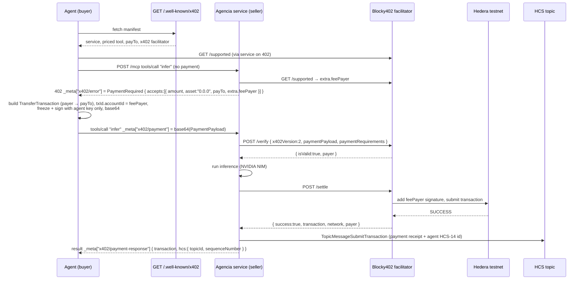

# Agencia

Pay-per-call AI inference on **Hedera**, gated by the **x402** payment standard (v2, `exact` scheme) and settled through the **Blocky402** facilitator. An autonomous agent discovers the service from a public manifest and pays for each call in **HBAR** — no API key, no subscription.

Payment plumbing uses the official **[`@x402/core`](https://www.npmjs.com/package/@x402/core) + [`@x402/hedera`](https://www.npmjs.com/package/@x402/hedera)** SDK, so the wire format is exactly what Blocky402 expects.

Agencia is a headless service (HTTP + MCP) plus a CLI agent. An Astro frontend in [`web/`](web/README.md) provides a landing page and a live dashboard that consumes the service (discover → pay HBAR → receipt) from the browser.

---

## Architecture



### Payment flow (x402 v2 `exact` on Hedera)

1. **Discover** — agent fetches `GET /.well-known/x402`: the priced `infer` tool, `payTo`, the Blocky402 facilitator URL, the pricing model.
2. **402** — the first `infer` call carries no payment, so the tool returns `isError: true` with `_meta["x402/error"]` = a v2 `PaymentRequired`. Its `accepts[0]` carries `amount` (tinybar), `asset: "0.0.0"` (HBAR), `payTo`, `maxTimeoutSeconds`, and `extra.feePayer` — the last **fetched live from Blocky402's `GET /supported`**.
3. **Build** — the agent builds a `TransferTransaction` (agent → `payTo` for `amount`), sets `transactionId.accountId` to the facilitator's `feePayer`, freezes it, and signs **only with the agent key** (partially signed). Base64-encoded into a `PaymentPayload`.
4. **Retry** — the agent repeats the call with `_meta["x402/payment"]` = base64 `PaymentPayload`, plus `_meta["agencia/agent-id"]` = its HCS-14 identifier.
5. **Verify** — the service `POST`s `{ x402Version: 2, paymentPayload, paymentRequirements }` to Blocky402 `/verify`, which checks transaction layout, feePayer safety, asset/amount exactness, and the payer signature.
6. **Serve + settle** — the service runs the inference, then `POST`s to `/settle`; Blocky402 adds the `feePayer` signature and submits the transaction to Hedera, returning `{ success, transaction, network, payer }`.
7. **Audit** — the settled receipt (incl. the agent's HCS-14 id) is written to an HCS topic; the response carries `_meta["x402/payment-response"]` with `{ transaction, hcs: { topicId, sequenceNumber } }`.

### Pricing — metered, not flat

```
price(args) = perCallHbar + per1kTokenHbar * (max_tokens / 1000)
```

The caller's `max_tokens` sets the price deterministically, so `amount` is exact — the agent pays for the capacity it reserves, not a flat per-request fee.

---

## Project structure

```
src/
  config.ts                    env, HBAR/tinybar helpers, CAIP-2 network
  x402.ts                      v2 type re-exports, X-PAYMENT codec, _meta keys
  facilitator.ts               HTTPFacilitatorClient → Blocky402 (verify/settle/supported)
  hedera.ts                    HCS client, topic create + message (@hashgraph/sdk)
  index.ts                     service entrypoint

  service/
    manifest.ts                /.well-known/x402 document
    http/{server,origin}.ts, http/routes/{health,manifest,mcp}.ts
    mcp/server.ts, mcp/tools/{discover,infer}.ts
    payments/paid-tool.ts      registerPaidTool: 402 → verify → run → settle → HCS audit
    capabilities/inference.ts  the paid work (NVIDIA NIM) + price function
    audit/hcs.ts               writes settlement receipts to HCS

  agent/
    discover.ts                fetch + parse the manifest
    wallet.ts                  x402Client + ExactHederaScheme + budget cap
    identity.ts                HCS-14 agent identifier + optional topic profile
    stream.ts                  metered streaming payments via Scheduled Transactions
    run.ts                     end-to-end: identity → discover → 402 → pay → retry → receipt

scripts/
  create-topic.ts              HCS topic creation (audit | identity)
  stream.ts                    run a metered payment stream
```

### HTTP routes

| Method | Path | Purpose |
|---|---|---|
| `GET` | `/health` | status, network, x402 version, facilitator, payTo, topic |
| `GET` | `/.well-known/x402` | discovery manifest |
| `ALL` | `/mcp` | MCP streamable-http (`discover`, `infer` tools) |

---

## Setup

### 1. Accounts

Create two Hedera **testnet** accounts at [portal.hedera.com](https://portal.hedera.com): one for the Agencia service, one for the agent. Fund both with test HBAR. **ECDSA keys** are recommended (the x402 Hedera live path assumes ECDSA).

### 2. Install

```bash
cd hedera/agencia
npm install
cp .env.example .env
```

Fill in `.env`:

- `AGENCIA_OPERATOR_ID` / `AGENCIA_OPERATOR_KEY` — service account (also the HCS audit signer)
- `AGENCIA_PAY_TO` — where payments land (defaults to the operator)
- `AGENT_ACCOUNT_ID` / `AGENT_PRIVATE_KEY` — agent account
- `NVIDIA_API_KEY` — key for `integrate.api.nvidia.com` (model `openai/gpt-oss-120b`)
- `BLOCKY402_URL` — defaults to `https://api.testnet.blocky402.com` (testnet is open, no key)

### 3. Create the HCS topics

```bash
npm run create-topic           # -> AGENCIA_HCS_TOPIC_ID   (audit trail)
npm run create-topic identity  # -> AGENT_IDENTITY_TOPIC_ID (optional HCS-14 profile)
```

### 4. Run

```bash
# terminal 1 — the service
npm run server

# terminal 2 — the agent makes one real paid request
npm run agent "Summarize the Hedera consensus service in 3 bullets"

# optional — a metered payment stream (Scheduled Transactions)
AGENCIA_PAY_TO=0.0.xxxx npm run stream 20 5 0.001   # 20s, tick every 5s, 0.001 HBAR/s
```

Verify the HCS audit entry:

```bash
curl "https://testnet.mirrornode.hedera.com/api/v1/topics/<AGENCIA_HCS_TOPIC_ID>/messages"
```

---

## Challenge mapping

| Requirement | Status | Where |
|---|---|---|
| Live x402-gated service on Hedera, settled via Blocky402 | ✅ code + live `/supported` wired | `src/facilitator.ts`, `src/service/*` |
| Platform/agent consumes it, one real paid request end to end | ✅ code (needs funded accounts to run) | `src/agent/run.ts`, `web/` dashboard |
| README: setup, architecture, payment flow | ✅ | this file |
| Demo video ≤ 5 min | ❌ record after a live run | — |
| **Pay-per-call metering (not flat)** | ✅ | `priceInHbar` in `src/service/capabilities/inference.ts` |
| **Verifiable payment audit trail on HCS** | ✅ | `src/service/audit/hcs.ts` — receipt incl. agent id |
| **On-chain agent identity (HCS-14)** | ✅ (lightweight) | `src/agent/identity.ts` — `hcs-14:` id + optional topic profile, sent in `_meta` and logged in the HCS receipt |
| **Recurring / streamed payments via Scheduled Transactions** | ✅ | `src/agent/stream.ts`, `npm run stream` |
| **Agent discovery / directory** | 🟡 manifest + `discover` tool, not a UCP registry | `GET /.well-known/x402`, `src/agent/discover.ts` |
| **HTS tokens / custom fee schedules** | 🟡 `asset` flows through v2 requirements; only the HBAR (`0.0.0`) path is wired | `src/service/payments/paid-tool.ts` |
| **Multi-agent negotiation (A2A / ACP)** | ❌ not started | buyer agent is single-step |

---

## Status

`tsc --noEmit` clean. Verified locally against the **live Blocky402 testnet facilitator**: `/health`, the manifest, MCP `tools/list`, and the 402 challenge — the `accepts[0].extra.feePayer` is fetched from Blocky402's real `GET /supported` (`0.0.7162784` at time of writing). The actual paid round-trip (`/verify` + `/settle` + on-chain submit) needs two funded testnet accounts and `NVIDIA_API_KEY` — fill `.env` and run the two commands above.
