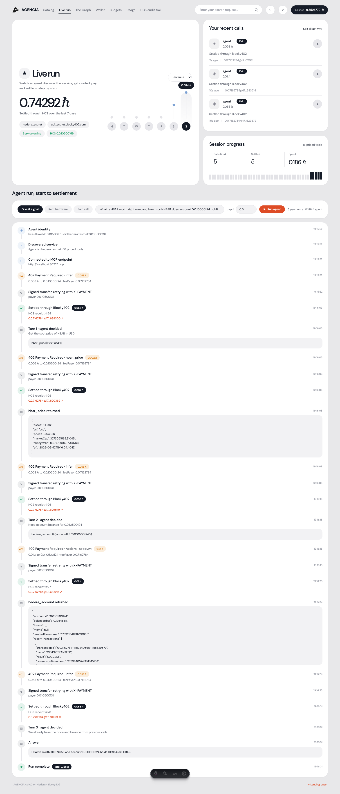
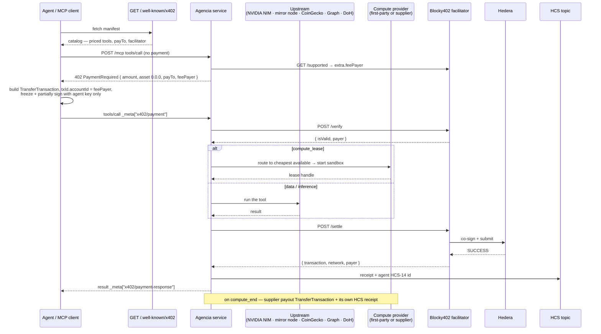

<div align="center">


# Agencia

### Connect your agent to every service it needs.

*Pay-per-call inference, on-chain data, price feeds and **metered hardware** on **Hedera** — gated by [x402](https://x402.org) (v2, `exact` scheme) and settled through the **[Blocky402](https://blocky402.com)** facilitator. No API key, no subscription, no invoice.*

[](https://hedera.com)
[](https://x402.org)
[](https://blocky402.com)
[](https://build.nvidia.com)
[](#-compute--rent-hardware-by-the-second)
[](https://docs.hedera.com/hedera/core-concepts/consensus-service)
[](https://thegraph.com)
[](https://modelcontextprotocol.io)
[](https://agencia.reroute-stellarbackend.workers.dev/health)
[](https://www.typescriptlang.org/)
[](https://astro.build)

**Live endpoint —** [`agencia.reroute-stellarbackend.workers.dev`](https://agencia.reroute-stellarbackend.workers.dev/health) · [manifest](https://agencia.reroute-stellarbackend.workers.dev/.well-known/x402) · MCP at `/mcp`

</div>

---

## What is Agencia?

Buying API access today means an account, a card, a subscription, a human in the loop. None of that works for an autonomous agent calling dozens of services on its own. Agencia replaces the billing relationship with the request itself: an agent discovers a service from a public manifest, pays the exact price for **one call** in HBAR, and gets its answer — settled on Hedera in under a second, for a fraction of a cent.

It runs in both directions. **Consumers** buy inference, on-chain data and sandboxed hardware per unit. **Suppliers** register their own machines against a five-endpoint contract and get paid in HBAR for every second they sell.

**Five ways in:**

- **Dashboard** — a live console: browse the catalog, watch an agent discover and pay step by step, rent hardware and drive it from a browser terminal.
- **Autonomous agent** — `npm run goal "<goal>"`: it reads the catalog at runtime, **buys its own reasoning**, picks its own tools, and answers.
- **Drop-in client** — `AgenciaClient.connect()` handles discovery, the 402 handshake, signing and budget caps in three lines.
- **MCP endpoint** — point any MCP client at `/mcp`; every tool is listed with no credentials at all.
- **One-command onboarding** — `npm run onboard` issues a funded testnet wallet and makes a real paid call, start to finish.

> **The only credential anywhere in this project is a Hedera keypair.** Not for the catalog, not for the hardware, not even for the agent's own reasoning — it pays for that through the same rail.

---

## Features

### 🛒 The catalog — 16 priced tools, 8 categories

Every row is a real paid MCP tool through the same `registerPaidTool` wrapper: **402 → verify → run → settle → HCS receipt**.

| Tool | Category | What it does | Price (ℏ) |
|---|---|---|---|
| `infer` | Inference | Chat completion on **NVIDIA NIM** (`openai/gpt-oss-20b`) | `0.05` + `0.02`/1k tok |
| `infer_openai` | Inference | Chat completion on OpenAI (`gpt-4o-mini`) | `0.03` + `0.015`/1k tok |
| `compute_lease` | Compute | Rent a sandboxed container by the second | `0.01` + `0.0015`/vCPU-s |
| `compute_tick` | Compute | Extend a live lease by one metering interval | `0.0015`/vCPU-s |
| `hedera_account` | Hedera Data | Balance, HTS holdings, recent transfers | `0.01` |
| `hedera_token` | Hedera Data | HTS supply, treasury, type, top holders | `0.01` |
| `hedera_topic` | Hedera Data | Recent HCS consensus messages | `0.005` + `0.0005`/msg |
| `hedera_transaction` | Hedera Data | Result, fee, transfers for a transaction id | `0.01` |
| `hedera_network` | Hedera Data | HBAR supply + live USD exchange rate | `0.003` |
| `hedera_nft` | NFTs | Owner, metadata, mint time for an NFT serial | `0.01` |
| `hbar_price` | Finance | HBAR spot price, 24h change, market cap | `0.002` |
| `crypto_price` | Finance | Spot price for up to 25 coins | `0.003` |
| `web_read` | Web | Fetch a URL, return title + readable text | `0.01` |
| `dns_lookup` | Web | Resolve DNS over Cloudflare DoH | `0.004` |
| `graph_query` | The Graph | GraphQL against any subgraph | `0.01` |
| `github_repo` | Dev | Stars, forks, issues, license for a repo | `0.005` |

Plus four **free** tools that need no payment: `discover`, `compute_exec`, `compute_end`, `compute_providers`.

Prices are computed per call — `infer` scales with `max_tokens`, `hedera_topic` with messages returned, `compute_lease` with seconds × vCPU. Nothing is a flat per-request tax.

<div align="center"></div>

### 🛰️ On-chain discovery — no URL required

A service announces itself to a **Hedera consensus topic**. An agent that knows only the topic id reads the registry off the mirror node, picks a service, fetches its catalog and pays it — nobody hands it an endpoint:

```
$ npm run find
[agent] reading the x402 service registry on HCS topic 0.0.10521746

  Agencia — hedera:testnet
    origin    http://localhost:3022
    payTo     0.0.10500124 (HBAR, api.testnet.blocky402.com)
    tools     16 priced · from 0.002 ℏ · Inference, Hedera Data, NFTs, Finance, Web, The Graph, Compute, Dev
    audit     0.0.10500159

[agent] nobody gave me a URL — fetching Agencia's catalog from its announcement
[agent] 4 tools need no arguments — cheapest is hbar_price at 0.002 ℏ
  402 hbar_price — paying 0.002 HBAR
  settled — HCS receipt #56
```

The announcement is a compact pointer (627 bytes, one HCS message) — identity, endpoint, payTo, tool count and price floor — with the full catalog left at `/.well-known/x402`. Any service can publish to the same topic; the registry is a public consensus log, not our database.

### 🤖 The autonomous agent — discovery you can watch

`npm run goal "what is HBAR worth, and how much does 0.0.10500124 hold?"`

The agent holds **one credential: a Hedera keypair.** It fetches `/.well-known/x402`, builds its tool list at runtime, then **buys its own reasoning** through the same x402 rail before every decision:

| Turn | What it did | Cost |
|---|---|---|
| 1 | bought reasoning → *"Get the spot price of HBAR in USD"* → chose `hbar_price` | `0.058` + `0.002` ℏ |
| 2 | bought reasoning → *"Need account balance"* → chose `hedera_account` | `0.058` + `0.01` ℏ |
| 3 | bought reasoning → *"We already have both"* → answered | `0.058` ℏ |

Nobody told it `hbar_price` existed. Every step is receipted on HCS. The **Live run** tab streams this over SSE, one card per phase — identity → discovery → 402 → signature → settlement → HCS receipt.

<div align="center"></div>

### 🖥️ Compute — rent hardware by the second

A lease is a session, not a one-shot call: **open → exec → tick → end.**

- **Metered per CPU-second**, not per request. Execution is *free* — you pay for seconds, and command time is metered onto the receipt.
- **Streaming settlement** — each `compute_tick` is its own x402 settlement with its own HCS receipt. Stop paying and the reaper kills the box.
- **Routed across providers** — the cheapest available provider wins; the price the buyer sees is the list rate, so routing widens margin instead of moving the quote.
- **Owned by the wallet that paid.** The payer's account id is bound to the lease at settlement, and a one-time **lease token** is issued with it. Terminal access, ticks and teardown all require that token — another wallet cannot touch your box.
- **Survives restarts.** Leases persist to disk with their container handles. Restart the service and live leases resume, their containers untouched; only genuinely expired ones are reaped.
- **Installs what you're missing, after you agree.** `compute_install` never downloads anything on the first call — it replies with the exact command it *would* run and waits for `confirm: true`.
- **Sandbox hardening** — non-root, `cap-drop ALL`, no-new-privileges, read-only rootfs with exec tmpfs, pids/CPU/memory caps, hard lease ceiling, orphan sweep on boot. Opt into `writable: true` at lease time if you need a package manager; the box is then root-writable and labelled as such.

| Surface | What you get |
|---|---|
| Dashboard **Compute** tab | Live hardware inventory, a lease control, and a browser terminal |
| `compute_exec` over MCP | Run commands from an agent — covered by the lease |
| `AgenciaClient` | `await agencia.call("compute_exec", { leaseId, command })` |
| `npm run lease 30 2` | Full lifecycle from a terminal |
| `compute_install` | Ask-then-install packages into your box |

**Choose your hardware:** runtime image (Node / Python / Alpine / Debian), vCPU, memory, `writable` mode, and either a named provider or `auto` for the cheapest one online. The provider list shows each machine's live rate, GPU flag and availability.

Hardware inventory is read live from the runtime (`docker info`), not declared in config — the card shows real vCPU, memory, daemon version and active lease count, and offline suppliers are shown as offline.

<div align="center"></div>

### 🤝 The supplier side — an allowlist marketplace

Agencia doesn't integrate vendor SDKs; **suppliers integrate Agencia.** Anyone with a machine runs one script:

```bash
SUPPLIER_LABEL="my rig" SUPPLIER_RATE_PER_SECOND_HBAR=0.0004 npm run supplier
```

It serves five endpoints (`/health`, `POST /sandboxes`, `/exec`, `/extend`, `DELETE`), self-registers with its asking rate and **Hedera payout account**, and waits to be allowlisted. When a lease closes, the supplier is paid on-chain automatically:

| Leg | Rail | Receipt |
|---|---|---|
| Consumer → Agencia | x402 / Blocky402 | HCS receipt per call and per tick |
| Agencia → Supplier | direct `TransferTransaction` (70% default) | HCS receipt per payout |

The same contract is how third-party clouds plug in. `src/service/compute/directory.ts` lists researched providers with their real cost basis, converted live to HBAR — marked `not-configured` until someone actually onboards them:

| Provider | Kind | Cost basis | Adapter |
|---|---|---|---|
| E2B · Daytona | sandbox | ~`0.000217` ℏ/vCPU-s | shim |
| Cloudflare Containers | container | ~`0.000284` ℏ/vCPU-s | Worker shim |
| Modal | sandbox + **GPU** | ~`0.000528` ℏ/vCPU-s | shim |
| Fly.io Machines | VM | per-second | REST — least shim code |
| Shadeform · Prime Intellect | aggregator | 20–30+ clouds | shim |
| Vast.ai · Akash · Nosana · io.net | GPU marketplace | spot / on-chain lease | shim |

### 💸 Two payment rails

| Rail | Shape | Use it for |
|---|---|---|
| **x402** (`exact`, v2) | settle per call, or per tick on a lease | inference, data, compute |
| **Scheduled Transactions** | one `ScheduleCreateTransaction` per interval | bandwidth, subscriptions, anything billed by time |

The dashboard drives both: a **stream payments** toggle auto-pays lease ticks as expiry approaches, and the **Streamed payments** card fires scheduled transfers with live HashScan links.

### 🔑 Onboarding — zero to paying

`POST /onboard` mints a real ECDSA testnet account, funds it, returns the key **once**, and keeps no copy (testnet-only, rate-limited, disableable).

```
no wallet configured — requesting one from the service…
✓ issued 0.0.10519636 on hedera:testnet, funded with 5 HBAR
✓ private key written to .env (never printed, never kept by the service)
  402 hbar_price — paying 0.002 HBAR
  settled — HCS receipt #29
```

<div align="center"></div>

### 📊 The dashboard — 10 tabs

**Catalog** · **Connect** · **Live run** · **Compute** · **Playground** · **The Graph** · **Wallet** · **Budgets** · **Usage** · **HCS audit trail**

A wallet menu in the corner carries balance, session spend, caps, copy-id, HashScan and wallet issuance. Budgets are enforced **server-side before a payment is built**. Usage charts are derived from the on-chain HCS trail, not from local state.

---

## 🏛️ Architecture



| Layer | Role | Backed by |
|---|---|---|
| Discovery | Priced catalog, pricing, payTo | `GET /.well-known/x402` |
| Payment | Build, verify, settle | `@x402/core` + `@x402/hedera`, Blocky402 |
| Settlement | Final submission | Hedera testnet / mainnet |
| Audit | Immutable receipts — both legs | one HCS topic |
| Inference | The model behind `infer` | **NVIDIA NIM** (`integrate.api.nvidia.com`) |
| Compute | Sandboxed hardware | local container runtime + allowlisted suppliers |
| Marketplace | Routing, allowlist, payouts | `src/service/compute/` |

### Pricing — metered, not flat

```
price(args) = perCallHbar + per1kTokenHbar * (max_tokens / 1000)     // infer
price(args) = perCallHbar + perResultHbar * limit                    // hedera_topic
price(args) = perCallHbar + perSecondHbar * seconds * cpu            // compute_lease
price(args) = perCallHbar                                            // everything else
```

Defined once per tool in `src/service/catalog.ts`, read by both the manifest and the tool that charges — quoted price and charged price can't drift.

---

## 🌐 Endpoints

| Method | Path | Purpose |
|---|---|---|
| `GET` | `/health` | status, network, x402 version, facilitator, payTo, topic |
| `GET` | `/.well-known/x402` | discovery manifest — the whole catalog |
| `ALL` | `/mcp` | MCP streamable-http — every tool |
| `GET` | `/providers` | marketplace: suppliers + provider directory, USD→HBAR live |
| `POST` | `/providers/register` | a supplier self-registers (endpoint, rate, payout account) |
| `POST` | `/providers/:id/status` | allowlist / suspend a supplier (admin token) |
| `GET` | `/providers/suppliers` | registered suppliers and their earnings |
| `GET` | `/compute/inventory` | live hardware capacity, rates, active leases |
| `GET`·`POST` | `/onboard` | issue a funded testnet wallet |

**Dashboard APIs:** `/api/{call, compute, live, stream, onboard, wallet, audit, manifest, health}`

---

## 📁 Project structure

```
src/
  config.ts                  env, HBAR/tinybar helpers, CAIP-2 network, ipv4-first DNS
  x402.ts                    v2 type re-exports, X-PAYMENT codec, _meta keys
  facilitator.ts             HTTPFacilitatorClient → Blocky402 (verify/settle/supported)
  hedera.ts                  client, HCS topic + message, funded account creation
  index.ts                   service entrypoint

  service/
    catalog.ts               every tool: title, category, params, pricing — single source of truth
    manifest.ts              /.well-known/x402 document, built from the catalog
    http/routes/             health · manifest · mcp · providers · onboard
    mcp/tools/               discover · infer · openai · hedera · price · external · graph · compute
    payments/paid-tool.ts    registerPaidTool: 402 → verify → run → settle → HCS audit
    capabilities/            the paid work itself (NIM, mirror node, CoinGecko, Graph, DoH…)
    audit/hcs.ts             settlement receipts → HCS
    compute/
      types.ts               ComputeProvider contract
      registry.ts            routing, marketplace view, live inventory
      leases.ts              lease lifecycle, metering, ticks, reaper
      suppliers.ts           allowlist, registration, earnings
      payouts.ts             supplier payout TransferTransaction + receipt
      directory.ts           researched third-party providers + cost basis
      providers/local.ts     container runtime on the host
      providers/remote.ts    the five-endpoint contract any supplier implements

  client/index.ts            AgenciaClient — discovery + 402 + signing + budget caps
  agent/
    goal.ts                  autonomous: buys its reasoning, picks its own tools
    lease.ts                 full compute lease lifecycle
    run.ts                   single paid call, end to end
    wallet.ts · identity.ts · discover.ts · stream.ts

scripts/
  onboard.ts                 zero-to-paid: wallet + first real call
  supplier.ts                the supplier node anyone can run
  create-topic.ts · stream.ts

web/                         Astro dashboard
  src/pages/api/             call · compute · live (SSE) · stream (SSE) · onboard · wallet · audit
  src/components/dashboard/  Shell · WalletMenu · panels/*
  src/server/                pay-flow · live-run · free-call — the agent key never reaches the browser
```

---

## 🚀 Setup

### 1. Accounts

Create Hedera **testnet** accounts at [portal.hedera.com](https://portal.hedera.com) — or skip it and let the service issue one: `npm run onboard`. **ECDSA keys** are required (the x402 Hedera path assumes ECDSA).

> **Hollow accounts:** if you funded an account by sending HBAR to a raw EVM address, the mirror node shows `"key": null` until it pays for one transaction of its own. The x402 flow never makes the agent the fee payer, so settlement fails with `INVALID_SIGNATURE` until you send one self-paid bootstrap transaction. Accounts issued by `/onboard` are created with `setECDSAKeyWithAlias` and don't have this problem.

### 2. Install

```bash
cd hedera/agencia
npm install
cp .env.example .env
```

| Variable | What it does |
|---|---|
| `AGENCIA_OPERATOR_ID` / `_KEY` | service account — also signs HCS receipts and supplier payouts |
| `AGENCIA_PAY_TO` | where payments land (defaults to the operator) |
| `AGENT_ACCOUNT_ID` / `AGENT_PRIVATE_KEY` | the buying agent |
| `AGENT_BUDGET_HBAR` / `AGENT_MAX_PAYMENT_HBAR` | spend caps enforced before a payment is built |
| `NVIDIA_API_KEY` | powers `infer` via NVIDIA NIM |
| `OPENAI_API_KEY` | optional — powers `infer_openai` |
| `BLOCKY402_URL` | defaults to `https://api.testnet.blocky402.com` (testnet is open) |
| `GRAPH_API_KEY` | optional — query a bare subgraph id instead of a full URL |
| `COMPUTE_PROVIDERS` | `local` and/or remote provider ids |
| `COMPUTE_RATE_PER_SECOND_HBAR` · `COMPUTE_OPEN_FEE_HBAR` | list price for compute |
| `COMPUTE_TICK_SECONDS` · `COMPUTE_MAX_LEASE_SECONDS` | metering interval and hard ceiling |
| `COMPUTE_MAX_CPU` · `COMPUTE_MAX_MEM_MB` · `COMPUTE_IMAGE` | sandbox limits and base image |
| `COMPUTE_ADMIN_TOKEN` | required to allowlist suppliers |
| `COMPUTE_SUPPLIER_SHARE_PCT` | supplier's cut of each lease (default 70) |
| `ONBOARD_ENABLED` · `ONBOARD_FUND_HBAR` · `ONBOARD_MAX_PER_HOUR` | wallet issuance |

### 3. Create the HCS topics

```bash
npm run create-topic           # -> AGENCIA_HCS_TOPIC_ID      (audit trail)
npm run create-topic identity  # -> AGENT_IDENTITY_TOPIC_ID   (HCS-14 agent profile)
npm run create-topic registry  # -> AGENCIA_REGISTRY_TOPIC_ID (on-chain service discovery)
```

### 4. Run

```bash
npm run start                              # the x402 service on :3022
npm run onboard                            # wallet + one real paid call
npm run find                               # find services on-chain and buy from one
npm run goal "what is HBAR worth?"         # autonomous agent picks its own tools
npm run lease 30 2                         # rent hardware, exec, tick, close
npm run supplier                           # offer your machine to the marketplace
cd web && npm install && npm run dev       # dashboard on :4321
```

Verify any settlement on the audit topic:

```bash
curl "https://testnet.mirrornode.hedera.com/api/v1/topics/<AGENCIA_HCS_TOPIC_ID>/messages"
```

---

## ☁️ Deploy — the service runs on Cloudflare Workers

The x402 service is deployed at the **edge**, with no Node runtime anywhere in the request path:

```bash
npx wrangler secret bulk secrets.json   # operator key, topic id, NVIDIA key
npx wrangler deploy                     # → agencia.<subdomain>.workers.dev
```

Three things had to be true to make this work, and all three are verified live:

| Concern | Resolution |
|---|---|
| **Hedera SDK on Workers** | The SDK's browser build talks **gRPC-web over plain `fetch`** to `testnet-nodeXX-00-grpc.hedera.com:443`. Aliased in `wrangler.jsonc`; HCS receipts are written from the edge. |
| **`window is not defined`** | The browser build touches `window` while mapping responses — shimmed to `globalThis` in the Worker entry. |
| **MCP transport** | The Node `StreamableHTTPServerTransport` needs `req`/`res` objects that don't exist on Workers, so `worker/mcp.ts` implements the JSON-RPC surface (`initialize`, `tools/list`, `tools/call`) directly. Catalog, pricing, capabilities and the x402 logic stay shared with the Node build. |

**Compute is served by supplier nodes, including through the edge.** Any machine that runs `npm run supplier` becomes rentable hardware. Point the Worker at a compute-capable origin and the edge serves leases for real:

```bash
cloudflared tunnel --url http://localhost:3022     # expose the supplier-backed service
# set COMPUTE_ORIGIN_URL on the Worker to that URL, then redeploy
```

Verified end to end: a lease opened **through** `agencia.…workers.dev`, a command run on the rented box (`aarch64`), closed, settled with HCS receipt `#55`. With no origin attached the edge answers compute calls with a **pending** status and takes no payment — never "unknown tool".

**Known edge difference:** CoinGecko returns `403` to Cloudflare egress, so `hbar_price` / `crypto_price` fail on the deployed Worker while working locally. `hedera_network` exposes the same HBAR/USD rate straight from consensus and is unaffected.

---

## 🔒 Security & trust

The agent's private key never reaches a browser — the dashboard proxies the whole pay flow through its own backend. Budget caps are checked **before** a transaction is built. Sandboxes run non-root with dropped capabilities, a read-only rootfs, and CPU/memory/pid/wall-clock ceilings; orphaned containers are swept on boot. Wallet issuance is testnet-only and rate-limited, and issued keys are returned once and never stored. Every settled call and every supplier payout lands on an append-only HCS topic that anyone can read.

**Known gap:** leased sandboxes currently have unrestricted network egress (the box needs to reach the service to pay for inference from inside). Locking that to an allowlist is the next security task.

---

## ✅ Status

| Area | Status |
|---|---|
| Service + dashboard typecheck | ✅ `tsc --noEmit` and `astro check` clean |
| **Deployed on Cloudflare Workers** | ✅ live — paid call + HCS receipt `#51` settled from the edge, 516 KiB gzipped, 89 ms startup |
| HCS receipts from Workers (gRPC-web) | ✅ live — receipt `#50` written by the Worker itself |
| `hbar_price` / `crypto_price` on Workers | 🟡 CoinGecko 403s Cloudflare egress — works locally, needs an API key or a different source |
| **Full x402 paid round trip** | ✅ **live on testnet** — verify + settle + on-chain submit |
| `infer` (NVIDIA NIM) · `infer_openai` | ✅ live — real paid completions settled |
| Data tools (`hedera_*`, `*_price`, `web_read`, `dns_lookup`, `github_repo`) | ✅ tested against live upstreams |
| `graph_query` | 🟡 plumbing verified against the live gateway; a real query needs a subgraph URL or `GRAPH_API_KEY` |
| **Compute lease → exec → tick → end** | ✅ live — e.g. HCS receipts `#31`, `#32`, container reaped on close |
| **Supplier payout** | ✅ live — 70/30 split paid on-chain with its own HCS receipt |
| **On-chain service discovery (HCS registry)** | ✅ live — agent found the service from a topic id alone and paid it, HCS receipt `#56` |
| **Autonomous goal agent** | ✅ live — 5 settlements in one run, tools chosen by the model |
| **Wallet issuance → first paid call** | ✅ live — fresh account funded and paying on its first request |
| Streamed payments (auto-tick) | ✅ live — consecutive HCS receipts, box reaped when payments stop |
| Scheduled Transactions | ✅ live — real `ScheduleCreateTransaction`s with HashScan links |
| **Lease persistence + wallet ownership** | ✅ live — lease resumed across a service restart, exec still worked, foreign access refused |
| **Ask-before-install in the sandbox** | ✅ live — consent gate returns the command first; `jq-1.8.2` installed and ran after `confirm: true` |
| **Identity per wallet** (optional email) | ✅ `GET`/`POST /identity/:accountId`, spend and lease counts tracked per account |
| **Compute through the deployed Worker** | ✅ live — lease + exec + close via the edge, paid at the edge, HCS receipt `#55` |
| **Hardware selection** | ✅ runtime image, vCPU, memory, writable mode and a named provider (or cheapest-available) are all caller-selectable |
| Port publishing / preview URLs for leases | ⬜ not started — a leased box can't serve HTTP to its renter yet |
| Multi-agent negotiation (A2A / ACP) | ⬜ not started — price is fixed by the seller |
| HTS tokens / custom fee schedules | 🟡 `asset` flows through the v2 requirements; only the HBAR (`0.0.0`) path is wired |

---

## 📄 License

No license file is committed yet — treat this repo as **all rights reserved** until one is added.

<div align="center">
<sub>Built on <a href="https://hedera.com">Hedera</a> · <a href="https://x402.org">x402</a> · <a href="https://blocky402.com">Blocky402</a> · <a href="https://build.nvidia.com">NVIDIA NIM</a> · <a href="https://thegraph.com">The Graph</a> · <a href="https://modelcontextprotocol.io">MCP</a></sub>
</div>
